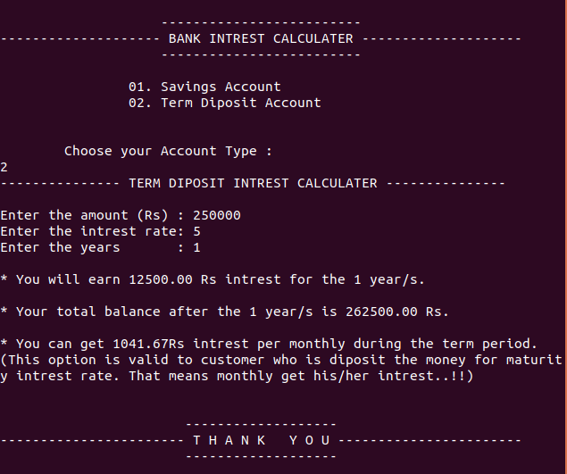

# Bank-Interest-Calculator-with-C
To calculate the interest you can get from your bank deposits.

This document shows how to compile and run this C program on Ubuntu Linux using the **gcc compiler**. Please follow these simple steps.

## Run on Ubuntu OS

1. Open your clone folder. 
2. Right click & select **Open Terminal**. 
3. Now your terminal path is set to your app location.
4. Type this command to compile app.c. 
```
gcc -o app app.c
```
5. After that press enter key and type below command to run your C programme.
```
./app
```


## App Summery

Maianly I focused in this simple interest calculator app with main two parts.
1. Savings Accounts interest Calculation
2. Term Deposits interest Calculation 

- User can select their account type which is he/she want to calculate the interest.
- Then after that user can input the **amount, interest rate, number of years.**
- The finally display on terminal how much interest earn for particular years, What is the total balance you have after that particular year, How much you can earn monthly.




